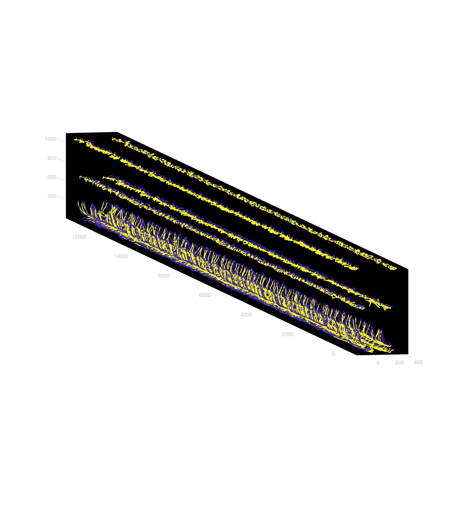

# Analysis and modelling of Locomotion Homework 3 : PCA analysis of motion-capture and EMG gait parameters

## Data processing pipeline

*List of parameters obtained from EMG and mo-cap :*

| parameter                               | implemented                           |
| --------------------------------------- | ------------------------------------- |
| average cycle time                      | computed using the get_cycle function |
| variance cycle time                     | computed using the get_cycle function |
| walking velocity                        | fixed for each dataset                |
| stance duration in cycle proportion     | computed using swing_stance           |
| step height normalized to stance height |                                       |
| stance width                            |                                       |

*Motion capture data from the H01_TDM_2kmh timeseries :*
